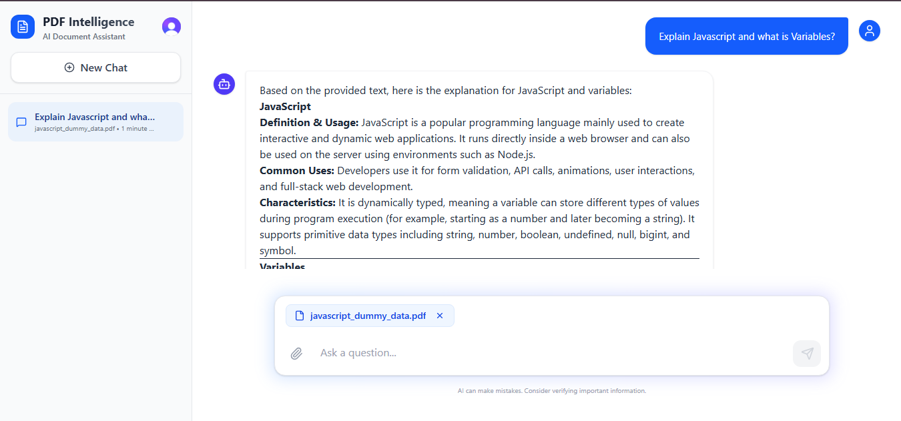

PDF Intelligence

AI-powered PDF Document Assistant that lets users upload a PDF and ask questions about its content. The application uses RAG (Retrieval-Augmented Generation) to retrieve relevant information from the uploaded document before generating an answer with Gemini.

🚀 Features

📄 Upload PDF documents

🔍 Extract text from PDFs

✂️ Split PDF text into chunks

🧠 Generate embeddings using Gemini

🗄️ Store and search embeddings using Qdrant

🤖 Generate answers using Google Gemini

🔐 User authentication with Clerk

💬 Create and manage conversations

📝 Store chat history in MongoDB

🌐 React frontend with Express backend

☁️ Supports deployment with separate frontend/backend environments

🏗️ Architecture

Frontend
   ↓
Express.js Backend
   ↓
Clerk Authentication
   ↓
PDF Upload (Multer)
   ↓
PDF Text Extraction (pdf-parse)
   ↓
Text Chunking
   ↓
Gemini Embedding API
   ↓
Qdrant Vector Database
   ↓
Question Embedding
   ↓
Similarity Search
   ↓
Relevant PDF Context
   ↓
Google Gemini
   ↓
AI Answer
   ↓
MongoDB Conversation History

🧠 How RAG Works in This Project

RAG stands for Retrieval-Augmented Generation.

The application does not send the entire PDF directly to the LLM for every question. Instead:

The user uploads a PDF.

The backend extracts text from the PDF.

The extracted text is divided into smaller chunks.

Each chunk is converted into an embedding using Gemini.

Embeddings are stored in Qdrant.

The user asks a question.

The question is also converted into an embedding.

Qdrant performs a similarity search.

The most relevant chunk is retrieved.

The retrieved context and user's question are sent to Gemini.

Gemini generates the final answer.

The question and answer can be stored in MongoDB as conversation history.

🛠️ Tech Stack

Frontend

React.js

Vite

Tailwind CSS

Clerk

Backend

Node.js

Express.js

Multer

pdf-parse

CORS

dotenv

AI / RAG

Google Gemini API

Gemini Embeddings

Qdrant Vector Database

Database

MongoDB

Mongoose

Authentication

Clerk

📁 Backend Structure

backend/
│
├── models/
│   └── Conversation.js
│
├── upload/
│   └── Uploaded PDF files
│
├── public/
│
├── .env
├── index.js
└── package.json

🔑 Environment Variables

Create a .env file in the backend directory:

PORT=3000

MONGODB_URL=your_mongodb_connection_string

GEMINI_API_KEY=your_gemini_api_key

QDRANT_URL=your_qdrant_url
QDRANT_API_KEY=your_qdrant_api_key

CLERK_SECRET_KEY=your_clerk_secret_key
CLERK_PUBLISHABLE_KEY=your_clerk_publishable_key

FRONTEND_URL=http://localhost:5173

Never commit your .env file or API keys to GitHub.

▶️ Installation

Clone the repository and install dependencies:

npm install

Start the development server:

npm run dev

If the project uses the FastAPI/Express-style direct Node command instead, use the command configured in package.json.

The backend normally runs on:

http://localhost:3000

🔌 Main API Endpoints

Method

Endpoint

Description

GET

/

Check whether the server is running

GET

/api/create-collection

Create the Qdrant PDF collection

GET

/api/conversations

Get authenticated user's conversations

POST

/api/conversations

Create a new conversation

GET

/api/conversations/:id

Get a specific conversation

DELETE

/api/conversations/:id

Delete a conversation

POST

/api/upload

Upload PDF, retrieve context and generate AI answer

PDF Upload

POST /api/upload

The request uses multipart/form-data.

Expected fields include:

pdf
question
conversationId

The pdf field contains the uploaded PDF file.

🔐 Authentication

The backend uses Clerk for authentication.

Protected routes use the custom checkAuth middleware:

Request
   ↓
Clerk Middleware
   ↓
checkAuth
   ↓
Check userId
   ↓
Authenticated → Continue
Unauthenticated → 401

Conversation queries also use the authenticated userId, helping prevent users from accessing another user's conversation.

🗄️ MongoDB vs Qdrant

The project uses both databases, but for different purposes.

MongoDB

Used for application data such as:

Conversation information

User ID

PDF name

Questions

AI answers

Chat history

Qdrant

Used for:

PDF chunk embeddings

Vector similarity search

Retrieving relevant document context

In short:

MongoDB → Application / Conversation Data

Qdrant → Vector Search / RAG Retrieval

⚠️ Current Limitations

This is a working RAG implementation, but there are areas that can be improved.

1. Basic Chunking

The current implementation splits text using:

text.split("\n\n")

A more advanced implementation could use:

Recursive text splitting

Token-based chunking

Fixed-size chunks

Chunk overlap

2. Top-1 Retrieval

The current implementation retrieves only one result:

limit: 1

A better RAG pipeline could retrieve multiple relevant chunks using top-k retrieval.

3. Multiple PDF Handling

Current vector IDs are generated using:

id: index + 1

For multiple PDFs, this can cause ID collisions. A production implementation should use unique IDs and store metadata such as:

pdfId
userId
chunkId
text

4. Gemini API Free-Tier Quota

The application depends on Gemini API quotas and rate limits. Uploading a PDF can generate multiple embedding requests because each chunk is embedded separately.

If the API quota/rate limit is exceeded, requests may fail.

Possible improvements:

Batch embedding requests

Cache embeddings

Reduce unnecessary API calls

Use an appropriate paid API tier for production

5. No Chunk Overlap

Chunks currently do not overlap. Important information located at chunk boundaries could therefore be harder to retrieve.

6. File Cleanup

Uploaded files should be properly cleaned up after processing when they are no longer required.

7. Synchronous File Reading

The current implementation uses:

fs.readFileSync()

An asynchronous file-reading approach can be preferable for a production server to avoid blocking the event loop.

🔮 Future Improvements

Better document chunking

Chunk overlap

Top-k retrieval

Metadata filtering by PDF/user

Unique vector IDs

Embedding caching

Batch embedding

Streaming AI responses

Better prompt engineering

Source/page citations in answers

Support for multiple document types

Background PDF processing

Improved error handling

Rate-limit handling and monitoring

📸 Application Preview

The application provides a chat-style interface where users can:

Start a new conversation.

Upload a PDF.

Ask questions about the PDF.

Receive AI-generated answers.

Continue the conversation.

Access previous conversations from the sidebar.

👨‍💻 Project Explanation

PDF Intelligence is a RAG-based AI document assistant. The backend is built using Node.js and Express.js. PDF text is extracted using pdf-parse, converted into embeddings using Gemini, and stored in Qdrant for semantic search. When a user asks a question, the question is embedded and compared against the stored document vectors. The most relevant context is retrieved and passed to Gemini to generate the final answer. Clerk handles authentication and MongoDB stores conversation history.

📄 License

This project is intended for learning and development purposes.
